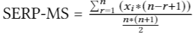

## Data Description

YouTube audit data was collected during audit experiments---<i>Search</i> and <i>Watch</i> audits. The audit experiments shed light on the phenomenon of algorithmically surfaced misinformation on YouTube and how that is affected by penalization attributes (gender, age, geolocation, and watch history). While <i>Search</i> audits are conducted using brand new user accounts, <i>Watch</i> audits examine user accounts that have built watch history by systematically watching either all promoting, neutral, or debunking videos of potentially misinformative topics. Our experiments collect 56,475 YouTube videos, spread across five popular misinformative topics and  correspond to three major components of YouTube: videos present in <i>search results</i>, <i>Up-Next</i>, and <i>Top 5</i> recommendations. The audit data is spread across four files. The description of each file along with their downloadable link is listed below.

**1. Queries file** 

filename: *queries.csv* [(download)](https://raw.githubusercontent.com/social-comp/YouTubeAudit-data/master/queries.csv)
   The file consists of a complete list of 49 search queries used in the audit study. It contains the following fields: -
   
  * ```ID:``` unique ID assigned to the search query
  * ```Topic:``` name of the misinformative search topic (9/11 conspiracy theories, chemtrail conspiracy theory, flat earth, moon landing conspiracy theories or vaccine controversies)
  * ```Seed Query:``` a collection of keywords representing the search topic
  * ```Query:``` search query name
  
   A snippet:
   
  
```html
ID    Topic     Seed Query   Query                                                                                                      
0     9/11     conspiracy theories     11-Sep   11-Sep
```

**2. Annotation Files**

* filname: *all_results.csv* [(download)](https://github.com/social-comp/YouTubeAudit-data/blob/master/all_results.csv?raw=true)
The file contains a collection of 56,475 videos compiled to link the stance of the video (promoting, debunking or neutral) with the personalization attribute audited (age, gender, geolocation or watch-history). The file contains the following fields: -
   * ```qid:``` unique ID assigned to the search query
   * ```vid_url:``` YouTube video URL	
   * ```vid_title:``` title of the YouTube video
   * ```aria-label:``` aria-label of the YouTube video	
   * ```annotation stance:``` stance assigned to the video by the annotators. The annotations are based on 9-point annotation scale ranging from -1 to 7
   * ```normalized_annotation:``` 3-point normalized scores with values -1(Promoting) , 0 (Neutral) and 1 (Debunking).
   * ```age_group:``` age group set while creating the google account This field can take values 1 (<18yrs), 2 (18-34yrs), 3 (35-50yrs) and 4 (>50yrs)
   * ```gender:``` gender set while creating google account (male/female)
   * ```activity:``` audit experiment during which the video was collected (search/watch)
   * ```activity_type:``` personalization attribute audited (demographics/geolocation)
   * ```topic:``` name of the misinformative search topic
   * ```geolocation:``` geolocation where the experiment was performed
   * ```geo_temperature:``` type of geolocation (hot/cold)
   * ```component_name:``` YouTube component audited/collected (Top5,SearchResults or UpNext)
   * ```order```	
   * ```vid_order```

A snippet:

```html
qid	vid_url	vid_title	aria-label	annotation	stance	normalized_annotation	age_group	gender	activity	activity_type	topic	geolocation	geo_temperature	component_name	order	vid_order                                                         

0	https://www.youtube.com/watch?v=9gCN7pIX3Es	Rare video from ground zero on 9/11	Rare video from ground zero on 9/11 by 60 Minutes 5 months ago 3 minutes, 14 seconds 1,072,478 views	0		0	3	Female	Search	Demographics	all	us-east1-b (South Carolina)		SearchResults
```


* filename: *uniqueResults.csv* [(download)](https://github.com/social-comp/YouTubeAudit-data/blob/master/uniqueResults.csv?raw=true)
The file contains a list of 2,943 unique videos along with their annotation values. It contains the following fields: -
   * ```topic:```	misinformative search topic 
   * ```aria-label:``` aria-label of the YouTube video
   * ```description:``` description of the YouTube video
   * ```vid_title:``` title of the YouTube video
   * ```vid_url:``` URL of the YouTube video
   * ```annotation:``` same as (2)
   * ```normalized_annotation:``` same as (2)
   * ```duration:``` duration of the YouTube video
   * ```viewCount:``` view count of the YouTube video
   * ```likeCount:``` like count of the YouTube video
   * ```dislikeCount:``` dislike of the YouTube video
   * ```favoriteCount:``` favorite count of the YouTube video
   * ```commentCount:``` comment count of the YouTube video
   * ```popularity:``` <i>popularity metric</i> value (see 3 for more details) of the YouTube video

A snippet:

```html
topic	aria-label	description	vid_title	vid_url	annotation	notes	normalized_annotation	duration	viewCount	likeCount	dislikeCount	favoriteCount	commentCount	popularity

911	Haunting, never-before-seen images of Ground Zero by CBS 7 years ago 3 minutes, 57 seconds 2,385,714 views	A few days after 9/11, FEMA sent its own cameras down into the ruins of the World Trade Center, filming for over 8 months and getting images no one else was able to get. CBS News justice and homeland security correspondent Bob Orr reports.	Haunting, never-before-seen images of Ground Zero	https://www.youtube.com/watch?v=coqYraFn-B4	0		0	237	2396779	8366	718	0	2649	2408512
```


**3. Popularity Metric Files**

foldername: *popularity_metric.zip* [(download)](https://github.com/social-comp/YouTubeAudit-data/blob/master/popularity_metric.zip?raw=true)
In our <i>watch</i> audit experiment, we build the history of YouTube accounts by automatically making them watch videos that are either all debunking, neutral or promoting the particular misinformative topic under audit investigation. We select 20 most popular videos for each of the misinformative topics. Popularity is calculated as the engagement accumulated by the video at the time of our experimental runs. It is calculated as: -

                popularity metric = like count + dislike count + view count + comment count + favorite count

The folder consists of 15 files (5 misinformative topics X 3 misinformative stance). Each file contains a list of video URLs that were used to build YouTube accounts' watch history along with video metadata (duration, view count, like count, dislike count, favorite count and comment count) and <i>populatity metric</i> value for every video.

A snippet:

```html
Id	qid	topic	query	vid_url	vid_title	aria-label	Stance	duration	viewCount	likeCount	dislikeCount	favoriteCount	commentCount	popularity
17	0	9/11 conspiracy theories	11-Sep	https://www.youtube.com/watch?v=MNyjZJOEXpE	How the 9/11 terror attacks unfolded | Telegraph Time Tunnel	How the 9/11 terror attacks unfolded | Telegraph Time Tunnel by The Telegraph 2 years ago 2 minutes, 8 seconds 3,589,933 views	-1	128	3987854	8264	2786	0	1	3998905
```

**4. SERP-MS scores** 

filename: *all_Top10_SERP-MM.csv* [(download)](https://raw.githubusercontent.com/social-comp/YouTubeAudit-data/master/all_Top10_SERP-MM.csv) The file contains the SERP-MS scores (SERP Misinformation Score) of the search engine results page retrieved during the audit experiments. SERP-MS is a scoring metric that captures the amount of misinformation while taking into account the ranking of search results. It can be calculated as : -

<p align="center">
  
</p>


where <i>r</i> is the rank of the search result, <i>n</i> is the number of search results present in the SERP and <i>x</i> is the annotation value (-1: promoting, 0:neutral or 1:debunking). We only consider the top 10 search results for computing SERP-MS. Thus, SERP-MS is a continuous value ranging between -1 (all top 10 videos are debunking) to +1 (all top 10 are promoting).

The file contains the following fields: -
   * ```qid:``` unique ID assigned to the search query
   * ```query:``` search query name	
   * ```query_stance:``` stance assigned to the search query. It can take 3 valuues namely, -1(Promoting) , 0 (Neutral) and 1 (Debunking)
   * ```topic:``` name of the misinformative search topic
   * ```age_group:``` age group set while creating the google account
   * ```gender:``` gender set while creating google account (male/female)
   * ```activity:``` audit experiment during which the video was collected (search/watch)
   * ```activity_type:``` personalization attribute audited (demographics/geolocation)
   * ```stance:``` stance assigned to the video by the annotators. The annotations are based on 9-point annotation scale ranging from -1 to 7
   * ```geolocation:``` geolocation where the experiment was performed
   * ```geo_temperature:``` type of geolocation (hot/cold)
   * ```normalized_smm:``` SERP-MM score of the SERP
   
   A snippet:

```html
qid	query	query_stance	topic	age_group	gender	activity	activity_type	stance	geolocation	geo_temperature	normalized_smm
0	11-Sep	0	911	2	Female	Watch	Geolocation	neutral	Georgia	cold	0
```

## Citation Information

If you use the dataset in your research, please cite the following paper:
> Eslam Hussein*, Prerna Juneja*, Tanushree Mitra. "Measuring Misinformation in Video Search Platforms: An Audit Study on YouTube". The 23rd ACM Conference on Computer-Supported Cooperative Work and Social Computing. 2020.


